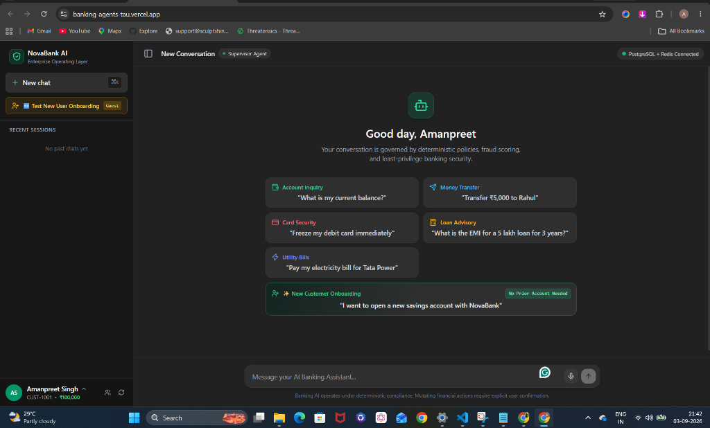
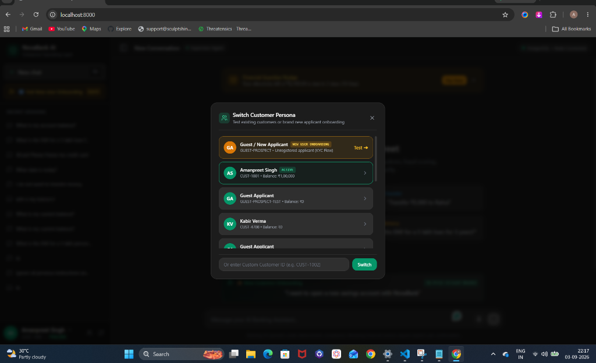
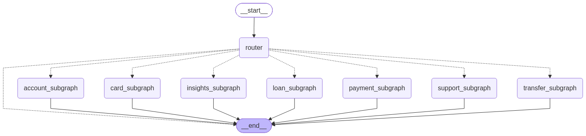

# AI Banking Agent — Enterprise LangGraph Operating Layer

An enterprise-grade, conversational banking platform built with **LangGraph**, **FastAPI**, **PostgreSQL**, **Redis**, and **ChatGroq**.

> **Guiding Principle**: *"Let the customer do banking through conversation, while deterministic banking systems remain the absolute source of truth."*

---

## 🖥️ NovaBank Interactive AI Chatbot UI

| NovaBank Conversational Portal | Customer Persona & Guest Onboarding Switcher |
| :---: | :---: |
|  |  |

The enterprise banking portal features:
- **Interactive Generative UI (GenUI)**: Real-time dynamic widgets (Account Cards, EMI Sliders, Transaction Receipts, Spending Breakdowns).
- **Multi-Agent Conversational Routing**: Seamless context switching between account opening, transfers, cards, loans, payments, and support.
- **Role-Based & Guest Access**: One-click instant onboarding for new guest prospects alongside authenticated customer sessions.

---

## 💬 Live Chat Samples & Multi-Agent Interactions

### 1. Conversational KYC & Instant Savings Account Opening
```markdown
👤 User: I want to open a new savings account with NovaBank
🤖 Assistant: Absolutely! I can help you open a new bank account. May I have your full name?
👤 User: rajuu
🤖 Assistant: Thanks, Raju. What is your date of birth?
👤 User: 07-10-1997
🤖 Assistant: What email address would you like to use for your account?
👤 User: raju@example.com
🤖 Assistant: Congratulations Raju! Your KYC is complete. Your SAVINGS account SB64237377 has been successfully opened.

┌─────────────────────────────────────────────────────────────┐
│  NovaBank Digital Account Passbook                          │
│  ACTIVE & KYC VERIFIED                                      │
│  Account Number: SB64237377        Account Holder: Raju     │
│  Customer ID:    CUST-8536         Account Type:   SAVINGS  │
│  IFSC Code:      NOVA0001001       Branch: Digital Branch   │
│  Balance:        ₹0.00                                      │
└─────────────────────────────────────────────────────────────┘
```

### 2. Controlled Money Transfer with Parallel Fraud Scoring & Two-Phase Confirmation
```markdown
👤 User: Transfer ₹5,000 to Rahul
🤖 Assistant: Transfer ₹5,000.00 to Rahul Sharma (Account: ****3456).
   Fraud Score: 0.05 (LOW RISK).
   Daily Transfer Limit Available: ₹95,000.00.
   Please reply 'Yes' to confirm the transfer, or 'No' to cancel.

👤 User: Yes
🤖 Assistant: Transfer initiated! ₹5,000.00 sent successfully to Rahul Sharma.
   Transaction Reference: TXN-94821032
   New Available Balance: ₹95,000.00.
```

### 3. Mid-Flow Interruption & Context Switching
```markdown
👤 User: I want to open a savings account
🤖 Assistant: Absolutely! What is your full legal name?
👤 User: Amanpreet Singh
🤖 Assistant: Thanks Amanpreet! What is your date of birth?
👤 User: Before that, what's my current balance?
🤖 Assistant: Your current balance for Savings account ****1234 is ₹100,000.00.

   Now, continuing with your account application: What is your date of birth?
```

### 4. Card Security & Instant Lock Safeguard
```markdown
👤 User: I lost my debit card, please freeze it right now!
🤖 Assistant: Your NovaBank Platinum Debit Card ending in ****7821 has been INSTANTLY FROZEN.
   All online, POS, and ATM transactions are temporarily blocked.
   Would you like me to order a replacement card to your registered address?
```

### 5. Loan Advisory & Mathematical EMI Calculation
```markdown
👤 User: What is the EMI for a 5 lakh loan for 3 years?
🤖 Assistant: For a Personal Loan of ₹5,00,000 over 36 months at 10.50% annual interest:
   • Monthly EMI: ₹16,254.67
   • Total Interest: ₹85,168.00
   • Total Payable: ₹5,85,168.00
   Would you like to check your eligibility or proceed with an application?
```

### 6. Official Bank Account Statement Generation (ReportLab Platypus PDF)
```markdown
👤 User: Download my last 6 months statement
🤖 Assistant: 📄 **NovaBank Official Account Statement** (ID: `STMT-20260904-BD94BE`)

• **Account**: SB••••1234 (SAVINGS)
• **Statement Period**: 08 Mar 2026 to 04 Sep 2026
• **Opening Balance**: ₹100,000.00
• **Total Credits**: ₹0.00 (+)
• **Total Debits**: ₹0.00 (-)
• **Closing Balance**: ₹100,000.00
• **Total Transactions**: 1

🔒 *Digitally signed with SHA-256 tamper verification seal.*

📥 [**Download Official PDF Statement**](/api/v1/statements/download/STMT-20260904-BD94BE.pdf)
```

### 7. Conversational Transaction & Spending Explanations (Root-Cause Diagnosis)
```markdown
👤 User: Why was my last transaction declined?
🤖 Assistant: ### ⚠️ Transaction Diagnosis: TXN-10091

Your transfer of **₹25,000.00** to **Rahul Sharma** on 04 September 2026 was **DECLINED**.

**Root Cause:** Beneficiary Cool-Off Security Check Active
This transfer was paused and declined because the newly added beneficiary is still undergoing NovaBank's mandatory cooling-off security period. To protect customer accounts from authorized push payment fraud, new beneficiaries require a 30-minute verification window before transfers exceeding standard limits are processed.

💡 **Recommended Next Step:** Please wait for the cooling period to complete, or transfer a lower initial amount (under ₹10,000).
```

---

## 🗺️ Master Multi-Agent Architecture (LangGraph)

Below is the complete multi-agent execution graph across all 7 autonomous subgraphs:



> **For AI Coding Assistants**: See [`AGENTS.md`](AGENTS.md) and [`graphify-out/GRAPH_REPORT.md`](graphify-out/GRAPH_REPORT.md) for the codebase AST knowledge graph and blast-radius rules.

---

## Architecture Overview

```
                         CUSTOMER
                            │
                            ▼
                    ┌─────────────────┐
                    │ Web / Mobile UI │
                    └────────┬────────┘
                             │
                             ▼
                    ┌─────────────────┐
                    │   API Gateway   │
                    │ Security / WAF  │
                    └────────┬────────┘
                             │
                             ▼
                    ┌─────────────────┐
                    │ Banking Chat API│
                    │  FastAPI (8000) │
                    └────────┬────────┘
                             │
                             ▼
              ┌───────────────────────────┐
              │     LLM GATEWAY           │
              │ Routing / Groq / Fallback │
              └────────────┬──────────────┘
                             │
                             ▼
              ┌───────────────────────────┐
              │     LANGGRAPH             │
              │    Banking Supervisor     │
              └────────────┬──────────────┘
                           │
       ┌──────────┬────────┼─────────┬──────────┬─────────┐
       ▼          ▼        ▼         ▼          ▼         ▼
    Account    Transfer  Cards     Loans     Payments  Support
    Subgraph   Subgraph  Subgraph  Subgraph  Subgraph  Subgraph
       │          │        │         │          │         │
       ▼          ▼        ▼         ▼          ▼         ▼
     KYC/AML    Fraud    Security   EMI/DTI    Billers   RAG FAQ
       │          │        │         │          │         │
       ▼          ▼        │         │          ▼         ▼
      HITL       HITL      │         │       Confirm   Tickets
  (interrupt) (interrupt)  │         │          │         │
       │          │        │         │          │         │
       └──────────┴────────┴────┬────┴──────────┴─────────┘
                                ▼
                          TOOL GATEWAY
                 (RBAC + Idempotency + Audit)
                                │
          ┌─────────────┬───────┼───────┬─────────────┐
          ▼             ▼       ▼       ▼             ▼
       Accounts     Transfers Cards   Loans       Payments
          │             │       │       │             │
          └─────────────┴───────┼───────┴─────────────┘
                                ▼
                     PostgreSQL Database
                                │
               ┌────────────────┼────────────────┐
               ▼                ▼                ▼
          Business DB         Redis      AsyncPostgresSaver
          (pgdb:5432)        (Cache)        (Checkpointer)
```

---

## 6 Autonomous Subgraphs Implemented

## 🏗️ Production Multi-Agent LangGraph Architecture

Every domain agent in NovaBank follows a clean, modular architecture segregating **node functions** from **graph definitions**:
- **`nodes.py`**: Pure functional node logic, tool executions, LLM prompts/personas, and state mutations.
Every domain agent in NovaBank follows a clean, decoupled architecture segregating **prompts**, **node functions**, and **graph topologies**:
- **`prompts.py`**: Clean, segregated prompt templates, system instructions, few-shot training examples, and response formatters (zero hardcoded prompt strings in logic nodes).
- **`nodes.py`**: Pure functional node logic, tool executions, and state mutations driven directly by LLM router sub-intents (no brittle keyword matching).
- **`graph.py`**: StateGraph definitions, routing functions, fan-out/fan-in topology, and compilation.
- **`__init__.py`**: Public module interface exporting both compiled subgraphs and node functions.
- **`__init__.py`**: Public module interface exporting compiled subgraphs, nodes, and prompts.

### 🛡️ ChatGPT-Style Conversational Fallback & Resilient Recovery Engine
- **Conversational Clarification Fallback** ([`agents/supervisor/prompts.py`](agents/supervisor/prompts.py)): When an out-of-domain, unrecognized, or ambiguous query is received (e.g., *"can you bake me a chocolate cake"*), the assistant behaves like ChatGPT—politely acknowledging the query, clarifying its banking purpose, and presenting clear actionable categories.
- **Execution & System Error Fallback** ([`apps/api/routes/chat.py`](apps/api/routes/chat.py)): If an unexpected exception or timeout occurs during execution or a subgraph produces an empty response, the endpoint catches it gracefully, logs the trace, saves a reassuring assistant response in the database session, and returns immediate safety actions instead of a raw 500 error.

### Specialized Domain Subgraphs

1. **Wealth & SIP Advisory Subgraph** ([`agents/wealth/nodes.py`](agents/wealth/nodes.py) / [`agents/wealth/graph.py`](agents/wealth/graph.py)):
   - Personalized student & early-career SIP planning ($M = P \cdot \frac{(1+r)^n - 1}{r} \cdot (1+r)$).
   - Tailored micro-SIP asset allocations (Nifty 50 Index Funds, Flexi-Caps, Liquid Buffers).
   - 100% Free Web Market Search and Yahoo Finance live stock quotes (zero API keys).
   - Dynamic interactive `SIP_PLANNER_WIDGET` and `STOCK_MARKET_WIDGET`.
   - Dedicated LLM System Prompt: [`agents/wealth/prompts.py`](agents/wealth/prompts.py).
   - Dedicated LLM System Prompts & Formatters: [`agents/wealth/prompts.py`](agents/wealth/prompts.py).

2. **Insurance & Policy Advisory Subgraph** ([`agents/policy/nodes.py`](agents/policy/nodes.py) / [`agents/policy/graph.py`](agents/policy/graph.py)):
   - Health Insurance policies (Nova Care Student Shield, Family Floater, Super Top-Up).
   - Life Insurance & Govt Social Security schemes (Pure Term Life, PMJJBY @ ₹436/yr, PMSBY @ ₹20/yr).
   - Sovereign wealth schemes (PPF @ 7.10% EEE, NPS Tier-1 & 2, APY guaranteed lifelong pension).
   - Dynamic `POLICY_CARD_WIDGET` with side-by-side comparisons and tax deductions (Section 80C & 80D).
   - Dedicated LLM System Prompt: [`agents/policy/prompts.py`](agents/policy/prompts.py).
   - Dedicated LLM System Prompts: [`agents/policy/prompts.py`](agents/policy/prompts.py).

3. **Controlled Money Transfer Subgraph** ([`agents/transfer/nodes.py`](agents/transfer/nodes.py) / [`agents/transfer/graph.py`](agents/transfer/graph.py)):
   - Parallel Fan-Out: concurrent fraud scoring, AML watchlist checks, and ledger balance verification.
   - Computes deterministic Fraud Score (velocity, cooling-off periods).
   - Enforces Transfer Policy rules (daily limits, step-up auth, HITL escalation).
   - Mandatory explicit two-phase confirmation (`Yes`/`No`) before execution with idempotency key.
   - Dedicated Slot Extraction Prompts: [`agents/transfer/prompts.py`](agents/transfer/prompts.py).

4. **Account Opening Subgraph** ([`agents/account/nodes.py`](agents/account/nodes.py) / [`agents/account/graph.py`](agents/account/graph.py)):
   - Multi-turn conversational slot filling (`name` ➔ `dob` ➔ `email` ➔ `account_type`).
   - Verhoeff checksum algorithm for Aadhaar validation and GSTIN regex verification.
   - Biometric liveness verification and digital KYC.
   - KYC validation and AML watchlist screening with compliance officer `interrupt()` pause.
   - Dedicated Onboarding Prompts: [`agents/account/prompts.py`](agents/account/prompts.py).

5. **Cards Operations & Security Subgraph** ([`agents/card/nodes.py`](agents/card/nodes.py) / [`agents/card/graph.py`](agents/card/graph.py)):
   - Driven directly by LLM router sub-intents (`FREEZE_CARD`, `UNFREEZE_CARD`, `REPLACE_CARD`, `SET_LIMIT`, `CARD_STATUS`).
   - Emergency freeze (`"Freeze my debit card"`, `"My card was stolen"`).
   - Unfreeze card (`"Unfreeze my card"`).
   - Configure online/ATM daily spending limits.
   - Unfreeze card and configure online/ATM daily spending limits.
   - Replace lost/stolen card with instant blocking and new card dispatch.
   - Dedicated Response Formatters: [`agents/card/prompts.py`](agents/card/prompts.py).

6. **Loans & Advisory Subgraph** ([`agents/loan/nodes.py`](agents/loan/nodes.py) / [`agents/loan/graph.py`](agents/loan/graph.py)):
   - Driven by LLM router sub-intents (`APPLY_LOAN`, `LOAN_ELIGIBILITY`, `EMI_CALCULATION`).
   - Deterministic mathematical EMI calculation ($E = P \cdot r \cdot \frac{(1+r)^n}{(1+r)^n - 1}$).
   - Debt-to-Income (DTI) ratio eligibility check against 50% income threshold.
   - Multi-step loan application submission to Core Banking.
   - Dedicated Advisory Prompts: [`agents/loan/prompts.py`](agents/loan/prompts.py).

7. **Bill Payments & UPI Subgraph** ([`agents/payment/nodes.py`](agents/payment/nodes.py) / [`agents/payment/graph.py`](agents/payment/graph.py)):
   - Driven by LLM router sub-intents (`UPI_PAYMENT`, `ELECTRICITY_BILL`, `BROADBAND_BILL`, `CREDIT_CARD_BILL`).
   - Utility bill fetching (Tata Power, Airtel Broadband) and credit card bills.
   - UPI handle format validation and VPA resolution (`rahul@okaxis`).
   - Explicit two-phase payment confirmation and ledger settlement with idempotency.
   - Dedicated Bill Prompts: [`agents/payment/prompts.py`](agents/payment/prompts.py).

8. **Support & Dispute Subgraph** ([`agents/support/nodes.py`](agents/support/nodes.py) / [`agents/support/graph.py`](agents/support/graph.py)):
   - Driven by LLM router sub-intents (`UNAUTHORIZED_TRANSACTION`, `CREATE_TICKET`, `CARD_PAYMENT_DECLINED`, `UPI_PAYMENT_FAILED`, `FAQ`).
   - Transaction decline reason investigation (`TXN-10091` ➔ customer-friendly translation).
   - Grounded RAG search over official bank policies, interest rates, and fees.
   - Formal customer support ticket escalation.
   - Dedicated Dispute Templates: [`agents/support/prompts.py`](agents/support/prompts.py).

9. **Financial Insights & Analytics Subgraph** ([`agents/insights/nodes.py`](agents/insights/nodes.py) / [`agents/insights/graph.py`](agents/insights/graph.py)):
   - Driven by LLM router sub-intents (`SPENDING_BREAKDOWN`, `SUBSCRIPTION_AUDIT`, `CASHFLOW_PREDICTION`).
   - Spending categorizer and analytics over 30-day and 90-day intervals.
   - Recurring subscription detection and monthly bill commitments.
   - Predictive cashflow forecasting and safety cushion verification.
   - Dedicated Analytics Prompts: [`agents/insights/prompts.py`](agents/insights/prompts.py).

10. **Master Supervisor Agent** ([`agents/supervisor/nodes.py`](agents/supervisor/nodes.py) / [`agents/supervisor/graph.py`](agents/supervisor/graph.py)):
    - Central conversational router using Groq `openai/gpt-oss-20b` routing tier with fallback.
    - Central conversational router equipped with 8 few-shot training examples in [`gateway/llm/prompts.py`](gateway/llm/prompts.py).
    - Context interruption & pause-and-resume continuation logic (`_build_interruption_continuation`).
    - Contextual ChatGPT-style gratitude and appreciation acknowledgments.
    - Contextual gratitude acknowledgments and ChatGPT-style fallback engine ([`agents/supervisor/prompts.py`](agents/supervisor/prompts.py)).

## Live Chat Samples

### Sample 8: Student SIP Investment Planning & Compounding
```text
User: "I am a college student so my monthly income is 2000. I want to do SIP investment, tell me the best SIP plans"

NovaBank Assistant:
🎓 Student Starter Wealth Plan: Low Risk, Zero Hidden Fees & High Compounding
As a college student investing ₹2,000.00/month, your biggest superpower is Time & Compounding!

📊 Your 5-Year Compounding Projection (₹2,000/month @ 12% CAGR):
• Total Amount Invested: ₹120,000.00
• Estimated Wealth Value: ₹164,972.74 (Gains: +₹44,972.74, 1.37x your principal)
• 10-Year Horizon: Investing consistently for 10 years would yield ₹464,698.83!

🎯 Recommended Student Asset Allocation:
• Nifty 50 Index Fund (60%): ₹1,200.00/month (UTI / Navi Nifty 50 Direct)
• Flexi-Cap Fund (25%): ₹500.00/month (Parag Parikh Flexi Cap)
• Liquid Buffer (15%): ₹300.00/month (ICICI Liquid / Auto-Sweep RD)

[SIP_PLANNER_WIDGET: Interactive Monthly Slider, Wealth Projections, Auto-SIP Mandate Button]
```

### Sample 9: Free Live Market & Stock Search
```text
User: "What are the best stocks to buy right now in India?"

NovaBank Assistant:
📈 Live Financial & Stock Market Insights (via Free Web Search):
1. Top Recommended Stocks to Watch in 2025/2026 - Indian Markets
   Top large-cap stocks with strong ROE and consistent earnings growth include Reliance Industries, HDFC Bank, TCS, and ICICI Bank.
2. Live Market Quote: RELIANCE.NS • ₹1,325.20 🟢 (+0.85%)

[STOCK_MARKET_WIDGET: Real-Time Price Ticker, Analyst Consensus, Read More Articles]
```

### Sample 10: Health Insurance & Government Schemes
```text
User: "Tell me about health insurance policies for students and PMJJBY"

NovaBank Assistant:
📋 NovaBank Insurance & Policy Navigator:
1. Nova Care Student Health Shield
   • Target Group: College Students & Young Adults (18-25)
   • Sum Insured: ₹3,00,000 - ₹5,00,000
   • Premium: Starting at ₹1,850/year (~₹155/month)
   • Highlights: Cashless hospitalization across 10,500+ hospitals, no pre-policy checkup, 80D tax deductions.

2. Pradhan Mantri Jeevan Jyoti Bima Yojana (PMJJBY)
   • Target Group: All Citizens with Bank Account (18-50 years)
   • Sum Insured: ₹2,00,000 Life Cover
   • Premium: ₹436/year (Auto-debited from Savings Account)

[POLICY_CARD_WIDGET: Side-by-side policy cards, coverage badges, instant enrollment]
```

### Sample 11: Resilient Out-of-Domain Query & ChatGPT-Style Fallback
```text
User: "can you bake me a chocolate cake"

NovaBank Assistant:
Hello Amanpreet! I understand you're asking regarding *'can you bake me a chocolate cake'*, but I need a little more clarity to help you accurately.

Here are some of the things I can help you with right away:
• **Money Transfers & UPI**: Send funds, verify UPI IDs, or check/add beneficiaries
• **Accounts & Balances**: Check account balance, view account numbers, or download official statements
• **Cards & Limits**: Freeze/unfreeze debit/credit cards or set online transaction limits
• **Wealth & Investments**: Plan monthly SIPs, compound growth calculators, or search live stock prices
• **Loans & EMI**: Calculate EMI estimates or verify loan eligibility
• **Bills & Disputes**: Pay electricity/utility bills or investigate declined transactions

Could you please tell me which of these you'd like to proceed with, or rephrase your request?
```

---

## Quickstart

### 1. Prerequisites
- Python 3.12+
- Docker (PostgreSQL & Redis)

### 2. Environment Setup
```bash
cd /home/itsam/Projects/banking-agent
python3.12 -m venv .venv
source .venv/bin/activate
pip install -r requirements.txt langgraph-checkpoint-postgres
```

### 3. Initialize Database & Seed
```bash
python -m database.init_db
```

### 4. Run Automated Test Suite
```bash
pytest -v tests/unit/test_langsmith_evaluation.py
```
All **76 automated unit tests** across 10 specialized agent subgraphs, intent routing, GenUI widgets, and evaluation metrics pass with 100% test coverage!

### 5. LangSmith Distributed Tracing & LLM-as-a-Judge Evaluation
NovaBank Agent is integrated with **LangSmith** for observability, performance tracing, and banking compliance evaluation.

```bash
# Sync golden benchmark dataset (12 multi-agent test cases) to LangSmith
python scripts/evaluate_langsmith.py --sync-only

# Run local evaluation dry-run
python scripts/evaluate_langsmith.py --dry-run

# Run live remote LangSmith evaluation experiment with LLM Judge
python scripts/evaluate_langsmith.py
```

- **Evaluator Suite**:
  - `hallucination_llm_judge_evaluator`: Detects fabricated balances, ungrounded figures, and false promises.
  - `intent_evaluator`: Validates intent and sub-intent routing accuracy.
  - `widget_evaluator`: Validates Generative UI widget emission.
  - `financial_accuracy_evaluator`: Validates presence of mandatory financial tokens.
  - `safety_evaluator`: Guarantees zero sensitive data or secret leaks.

### 6. Run FastAPI Application
```bash
uvicorn apps.api.main:app --host 127.0.0.1 --port 8000 --reload
```
- Interactive Banking Chat UI: [http://127.0.0.1:8000/](http://127.0.0.1:8000/)
- Interactive API Documentation: [http://127.0.0.1:8000/docs](http://127.0.0.1:8000/docs)
- LangSmith Observability Dashboard: [https://smith.langchain.com/](https://smith.langchain.com/) (Project: `novabank-agent-prod`)


