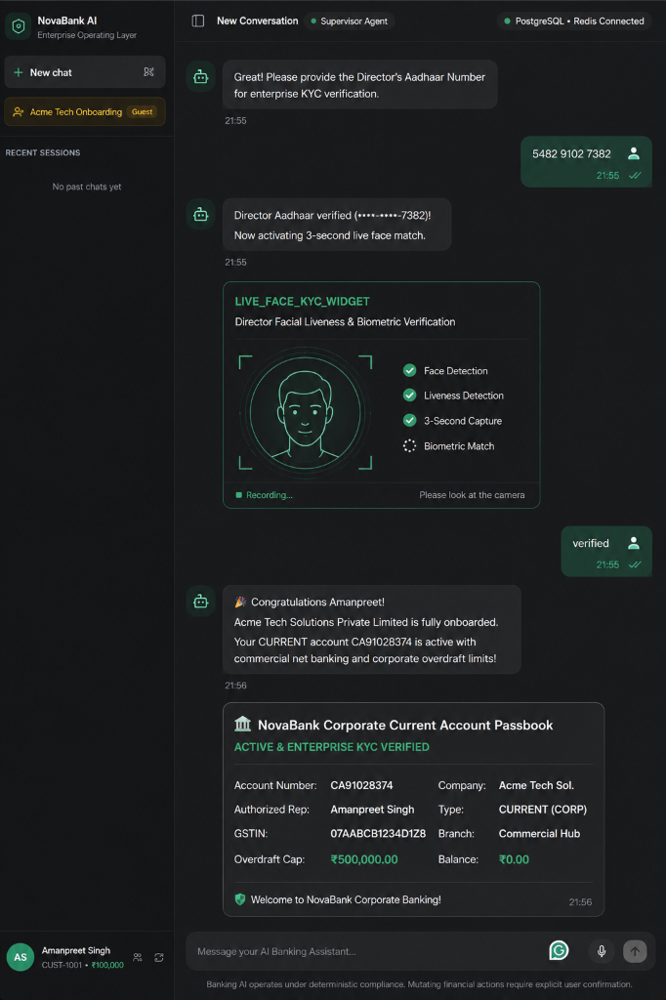
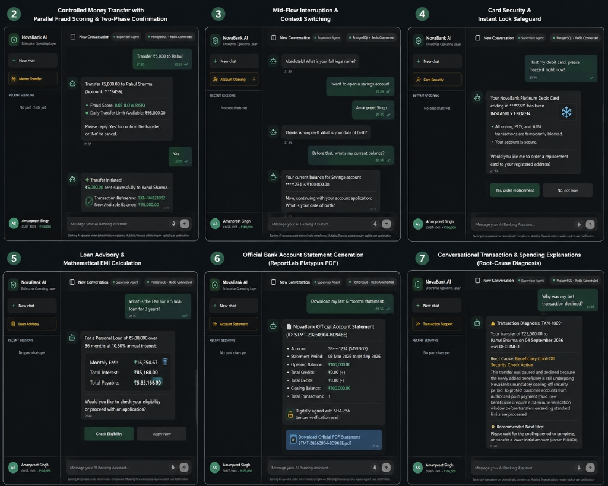
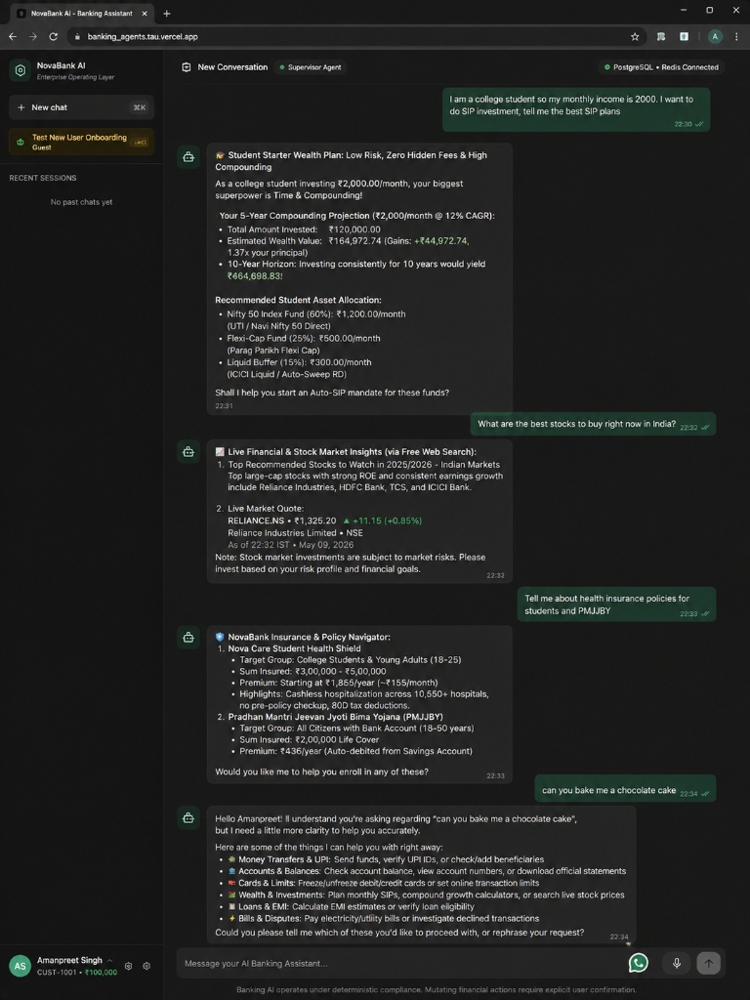

# AI Banking Agent — Enterprise LangGraph Operating Layer

An enterprise-grade, conversational banking platform built with **LangGraph**, **FastAPI**, **PostgreSQL**, **Redis**, and **ChatGroq**.

🌐 **Live Application**: [**https://banking-agents-tau.vercel.app/**](https://banking-agents-tau.vercel.app/)

> **Guiding Principle**: *"Let the customer do banking through conversation, while deterministic banking systems remain the absolute source of truth."*

---

## 🖥️ NovaBank Interactive AI Chatbot UI

🚀 **Live Interactive Demo**: [**banking-agents-tau.vercel.app**](https://banking-agents-tau.vercel.app/)

| NovaBank Conversational Portal | Biometric Video KYC & Corporate Passbook | Customer Persona Switcher |
| :---: | :---: | :---: |
|  |  |  |

The enterprise banking portal features:
- **Interactive Generative UI (GenUI)**: Real-time dynamic widgets (Account Cards, EMI Sliders, Transaction Receipts, Spending Breakdowns).
- **Multi-Agent Conversational Routing**: Seamless context switching between account opening, transfers, cards, loans, payments, and support.
- **Role-Based & Guest Access**: One-click instant onboarding for new guest prospects alongside authenticated customer sessions.

---

## 💬 Live Chat Samples & Multi-Agent Interactions

### Multi-Agent Workflows & Core Banking Safeguards
<p align="center">
  
</p>

- **Controlled Money Transfer**: Parallel fraud scoring, daily limit checks, and explicit two-phase confirmation before settlement.
- **Mid-Flow Interruption & Context Switching**: Seamlessly answers customer inquiries (e.g., balance check) mid-application, then automatically resumes the paused workflow.
- **Instant Card Freeze Safeguard**: Real-time card locking and replacement card issuance for compromised or lost cards.
- **Deterministic Loan EMI Calculation**: Live mathematical EMI computations and Debt-to-Income (DTI) ratio eligibility checks.
- **Official PDF Statements**: Automated ReportLab Platypus PDF generation with SHA-256 tamper-verification seal.
- **Root-Cause Transaction Diagnosis**: Plain-language customer explanation of banking decline codes (e.g., beneficiary cool-off limits).

### Biometric KYC & Dual-Track Digital Onboarding
<p align="center">
  
</p>

- **Retail Savings Account Onboarding**: Multi-turn demographic capture, 12-digit Aadhaar Verhoeff mathematical checksum validation, real-time facial liveness & blink detection, and instant passbook issuance (`SB••••`).
- **Commercial Current Account Onboarding**: Legal entity classification, 15-character GSTIN validation (Ministry of Corporate Affairs registry), authorized director biometric verification, and corporate passbook with overdraft facilities (`CA••••`).

---

## 🗺️ Master Multi-Agent Architecture (LangGraph)

Below is the complete multi-agent execution graph across all 7 autonomous subgraphs:


> **For AI Coding Assistants**: See [`AGENTS.md`](AGENTS.md) and [`graphify-out/GRAPH_REPORT.md`](graphify-out/GRAPH_REPORT.md) for the codebase AST knowledge graph and blast-radius rules.

---

## Architecture Overview

```
                         CUSTOMER
                            │
                            ▼
                    ┌─────────────────┐
                    │ Web / Mobile UI │
                    └────────┬────────┘
                             │
                             ▼
                    ┌─────────────────┐
                    │   API Gateway   │
                    │ Security / WAF  │
                    └────────┬────────┘
                             │
                             ▼
                    ┌─────────────────┐
                    │ Banking Chat API│
                    │  FastAPI (8000) │
                    └────────┬────────┘
                             │
                             ▼
              ┌───────────────────────────┐
              │     LLM GATEWAY           │
              │ Routing / Groq / Fallback │
              └────────────┬──────────────┘
                             │
                             ▼
              ┌───────────────────────────┐
              │     LANGGRAPH             │
              │    Banking Supervisor     │
              └────────────┬──────────────┘
                           │
       ┌──────────┬────────┼─────────┬──────────┬─────────┐
       ▼          ▼        ▼         ▼          ▼         ▼
    Account    Transfer  Cards     Loans     Payments  Support
    Subgraph   Subgraph  Subgraph  Subgraph  Subgraph  Subgraph
       │          │        │         │          │         │
       ▼          ▼        ▼         ▼          ▼         ▼
     KYC/AML    Fraud    Security   EMI/DTI    Billers   RAG FAQ
       │          │        │         │          │         │
       ▼          ▼        │         │          ▼         ▼
      HITL       HITL      │         │       Confirm   Tickets
  (interrupt) (interrupt)  │         │          │         │
       │          │        │         │          │         │
       └──────────┴────────┴────┬────┴──────────┴─────────┘
                                ▼
                          TOOL GATEWAY
                 (RBAC + Idempotency + Audit)
                                │
          ┌─────────────┬───────┼───────┬─────────────┐
          ▼             ▼       ▼       ▼             ▼
       Accounts     Transfers Cards   Loans       Payments
          │             │       │       │             │
          └─────────────┴───────┼───────┴─────────────┘
                                ▼
                     PostgreSQL Database
                                │
               ┌────────────────┼────────────────┐
               ▼                ▼                ▼
          Business DB         Redis      AsyncPostgresSaver
          (pgdb:5432)        (Cache)        (Checkpointer)
```

---

## 6 Autonomous Subgraphs Implemented

## 🏗️ Production Multi-Agent LangGraph Architecture

Every domain agent in NovaBank follows a clean, decoupled architecture segregating **prompts**, **node functions**, and **graph topologies**:
- **`prompts.py`**: Clean, segregated prompt templates, system instructions, few-shot training examples, and response formatters (zero hardcoded prompt strings in logic nodes).
- **`nodes.py`**: Pure functional node logic, tool executions, and state mutations driven directly by LLM router sub-intents (no brittle keyword matching).
- **`graph.py`**: StateGraph definitions, routing functions, fan-out/fan-in topology, and compilation.
- **`__init__.py`**: Public module interface exporting compiled subgraphs, nodes, and prompts.

### 🛡️ ChatGPT-Style Conversational Fallback & Resilient Recovery Engine
- **Conversational Clarification Fallback** ([`agents/supervisor/prompts.py`](agents/supervisor/prompts.py)): When an out-of-domain, unrecognized, or ambiguous query is received (e.g., *"can you bake me a chocolate cake"*), the assistant behaves like ChatGPT—politely acknowledging the query, clarifying its banking purpose, and presenting clear actionable categories.
- **Execution & System Error Fallback** ([`apps/api/routes/chat.py`](apps/api/routes/chat.py)): If an unexpected exception or timeout occurs during execution or a subgraph produces an empty response, the endpoint catches it gracefully, logs the trace, saves a reassuring assistant response in the database session, and returns immediate safety actions instead of a raw 500 error.

### Specialized Domain Subgraphs

1. **Wealth & SIP Advisory Subgraph** ([`agents/wealth/nodes.py`](agents/wealth/nodes.py) / [`agents/wealth/graph.py`](agents/wealth/graph.py)):
   - Personalized student & early-career SIP planning ($M = P \cdot \frac{(1+r)^n - 1}{r} \cdot (1+r)$).
   - Tailored micro-SIP asset allocations (Nifty 50 Index Funds, Flexi-Caps, Liquid Buffers).
   - 100% Free Web Market Search and Yahoo Finance live stock quotes (zero API keys).
   - Dynamic interactive `SIP_PLANNER_WIDGET` and `STOCK_MARKET_WIDGET`.
   - Dedicated LLM System Prompts & Formatters: [`agents/wealth/prompts.py`](agents/wealth/prompts.py).

2. **Insurance & Policy Advisory Subgraph** ([`agents/policy/nodes.py`](agents/policy/nodes.py) / [`agents/policy/graph.py`](agents/policy/graph.py)):
   - Health Insurance policies (Nova Care Student Shield, Family Floater, Super Top-Up).
   - Life Insurance & Govt Social Security schemes (Pure Term Life, PMJJBY @ ₹436/yr, PMSBY @ ₹20/yr).
   - Sovereign wealth schemes (PPF @ 7.10% EEE, NPS Tier-1 & 2, APY guaranteed lifelong pension).
   - Dynamic `POLICY_CARD_WIDGET` with side-by-side comparisons and tax deductions (Section 80C & 80D).
   - Dedicated LLM System Prompts: [`agents/policy/prompts.py`](agents/policy/prompts.py).

3. **Controlled Money Transfer Subgraph** ([`agents/transfer/nodes.py`](agents/transfer/nodes.py) / [`agents/transfer/graph.py`](agents/transfer/graph.py)):
   - Parallel Fan-Out: concurrent fraud scoring, AML watchlist checks, and ledger balance verification.
   - Computes deterministic Fraud Score (velocity, cooling-off periods).
   - Enforces Transfer Policy rules (daily limits, step-up auth, HITL escalation).
   - Mandatory explicit two-phase confirmation (`Yes`/`No`) before execution with idempotency key.
   - Dedicated Slot Extraction Prompts: [`agents/transfer/prompts.py`](agents/transfer/prompts.py).

4. **Account Opening Subgraph** ([`agents/account/nodes.py`](agents/account/nodes.py) / [`agents/account/graph.py`](agents/account/graph.py)):
   - **Dual Onboarding Lifecycles**: Dedicated, compliance-controlled state machines for **Retail Savings Accounts** vs **Commercial Current Accounts**:
     - **Retail Savings Account Lifecycle**:
       - Multi-turn conversational slot collection (`name` ➔ `dob` (18+ verification) ➔ `email`).
       - **12-Digit Aadhaar Card Verification**: Verhoeff mathematical checksum algorithm, OCR name match, and PII masking (`••••-••••-7382`) via `AADHAAR_UPLOAD_WIDGET`.
       - **Live Biometric Video & Blink Liveness KYC**: Real-time facial similarity matching and Eye Aspect Ratio (EAR) blink detection to prevent static screen/photo spoofing via `LIVE_FACE_KYC_WIDGET`.
       - Real-time AML watchlist / PEP screening (sanctioned flags trigger human compliance officer `interrupt()` pause).
       - Instant Core Banking digital passbook issuance (`SB••••`).
     - **Commercial Current Account Lifecycle (Business / Enterprise)**:
       - Authorized Director identification (`name`, `dob`, `email`).
       - Registered Business Name & Legal Entity classification (Private Limited, Partnership/LLP, Sole Proprietorship).
       - **15-Character GSTIN Verification**: Format validation (`07AABCB1234D1Z8`), state jurisdiction code validation, and Form GST REG-06 certificate verification via `GST_VERIFY_WIDGET`.
       - Authorized Director Aadhaar verification and facial liveness biometric KYC.
       - Corporate account issuance with commercial overdraft limits (`CA••••`).
   - Dedicated Onboarding Prompts: [`agents/account/prompts.py`](agents/account/prompts.py).

5. **Cards Operations & Security Subgraph** ([`agents/card/nodes.py`](agents/card/nodes.py) / [`agents/card/graph.py`](agents/card/graph.py)):
   - Driven directly by LLM router sub-intents (`FREEZE_CARD`, `UNFREEZE_CARD`, `REPLACE_CARD`, `SET_LIMIT`, `CARD_STATUS`).
   - Emergency freeze (`"Freeze my debit card"`, `"My card was stolen"`).
   - Unfreeze card and configure online/ATM daily spending limits.
   - Replace lost/stolen card with instant blocking and new card dispatch.
   - Dedicated Response Formatters: [`agents/card/prompts.py`](agents/card/prompts.py).

6. **Loans & Advisory Subgraph** ([`agents/loan/nodes.py`](agents/loan/nodes.py) / [`agents/loan/graph.py`](agents/loan/graph.py)):
   - Driven by LLM router sub-intents (`APPLY_LOAN`, `LOAN_ELIGIBILITY`, `EMI_CALCULATION`).
   - Deterministic mathematical EMI calculation ($E = P \cdot r \cdot \frac{(1+r)^n}{(1+r)^n - 1}$).
   - Debt-to-Income (DTI) ratio eligibility check against 50% income threshold.
   - Multi-step loan application submission to Core Banking.
   - Dedicated Advisory Prompts: [`agents/loan/prompts.py`](agents/loan/prompts.py).

7. **Bill Payments & UPI Subgraph** ([`agents/payment/nodes.py`](agents/payment/nodes.py) / [`agents/payment/graph.py`](agents/payment/graph.py)):
   - Driven by LLM router sub-intents (`UPI_PAYMENT`, `ELECTRICITY_BILL`, `BROADBAND_BILL`, `CREDIT_CARD_BILL`).
   - Utility bill fetching (Tata Power, Airtel Broadband) and credit card bills.
   - UPI handle format validation and VPA resolution (`rahul@okaxis`).
   - Explicit two-phase payment confirmation and ledger settlement with idempotency.
   - Dedicated Bill Prompts: [`agents/payment/prompts.py`](agents/payment/prompts.py).

8. **Support & Dispute Subgraph** ([`agents/support/nodes.py`](agents/support/nodes.py) / [`agents/support/graph.py`](agents/support/graph.py)):
   - Driven by LLM router sub-intents (`UNAUTHORIZED_TRANSACTION`, `CREATE_TICKET`, `CARD_PAYMENT_DECLINED`, `UPI_PAYMENT_FAILED`, `FAQ`).
   - Transaction decline reason investigation (`TXN-10091` ➔ customer-friendly translation).
   - Grounded RAG search over official bank policies, interest rates, and fees.
   - Formal customer support ticket escalation.
   - Dedicated Dispute Templates: [`agents/support/prompts.py`](agents/support/prompts.py).

9. **Financial Insights & Analytics Subgraph** ([`agents/insights/nodes.py`](agents/insights/nodes.py) / [`agents/insights/graph.py`](agents/insights/graph.py)):
   - Driven by LLM router sub-intents (`SPENDING_BREAKDOWN`, `SUBSCRIPTION_AUDIT`, `CASHFLOW_PREDICTION`).
   - Spending categorizer and analytics over 30-day and 90-day intervals.
   - Recurring subscription detection and monthly bill commitments.
   - Predictive cashflow forecasting and safety cushion verification.
   - Dedicated Analytics Prompts: [`agents/insights/prompts.py`](agents/insights/prompts.py).

10. **Master Supervisor Agent** ([`agents/supervisor/nodes.py`](agents/supervisor/nodes.py) / [`agents/supervisor/graph.py`](agents/supervisor/graph.py)):
    - Central conversational router equipped with 8 few-shot training examples in [`gateway/llm/prompts.py`](gateway/llm/prompts.py).
    - Context interruption & pause-and-resume continuation logic (`_build_interruption_continuation`).
    - Contextual gratitude acknowledgments and ChatGPT-style fallback engine ([`agents/supervisor/prompts.py`](agents/supervisor/prompts.py)).

## 📈 Wealth Advisory, Market Intel, Policies & Fallback Interactions

<p align="center">
  
</p>

- **Student SIP Investment Planning**: Compounding projections ($M = P \cdot \frac{(1+r)^n - 1}{r} \cdot (1+r)$), low-risk micro-SIP asset allocations, and interactive slider widget.
- **Free Live Market & Stock Search**: Live web market search, Yahoo Finance real-time stock quotes, and financial news without API keys.
- **Health Insurance & Government Schemes**: Comparison cards for student health shields, PMJJBY (₹436/yr), PMSBY, and sovereign schemes (PPF/NPS).
- **ChatGPT-Style Resilient Fallback**: Graceful handling of out-of-domain/ambiguous queries with polite clarification and suggested actionable banking topics.

---

## Quickstart

### 1. Prerequisites
- Python 3.12+
- Docker (PostgreSQL & Redis)

### 2. Environment Setup
```bash
cd /home/itsam/Projects/banking-agent
python3.12 -m venv .venv
source .venv/bin/activate
pip install -r requirements.txt langgraph-checkpoint-postgres
```

### 3. Initialize Database & Seed
```bash
python -m database.init_db
```

### 4. Run Automated Test Suite
```bash
pytest -v tests/unit/test_langsmith_evaluation.py
```
All **76 automated unit tests** across 10 specialized agent subgraphs, intent routing, GenUI widgets, and evaluation metrics pass with 100% test coverage!

### 5. LangSmith Distributed Tracing & LLM-as-a-Judge Evaluation
NovaBank Agent is integrated with **LangSmith** for observability, performance tracing, and banking compliance evaluation.

```bash
# Sync golden benchmark dataset (12 multi-agent test cases) to LangSmith
python scripts/evaluate_langsmith.py --sync-only

# Run local evaluation dry-run
python scripts/evaluate_langsmith.py --dry-run

# Run live remote LangSmith evaluation experiment with LLM Judge
python scripts/evaluate_langsmith.py
```

- **Evaluator Suite**:
  - `hallucination_llm_judge_evaluator`: Detects fabricated balances, ungrounded figures, and false promises.
  - `intent_evaluator`: Validates intent and sub-intent routing accuracy.
  - `widget_evaluator`: Validates Generative UI widget emission.
  - `financial_accuracy_evaluator`: Validates presence of mandatory financial tokens.
  - `safety_evaluator`: Guarantees zero sensitive data or secret leaks.

### 6. Run FastAPI Application
```bash
uvicorn apps.api.main:app --host 127.0.0.1 --port 8000 --reload
```
- **Live Production App (Vercel)**: [**https://banking-agents-tau.vercel.app/**](https://banking-agents-tau.vercel.app/)
- Local Banking Chat UI: [http://127.0.0.1:8000/](http://127.0.0.1:8000/)
- Interactive API Documentation: [http://127.0.0.1:8000/docs](http://127.0.0.1:8000/docs)
- LangSmith Observability Dashboard: [https://smith.langchain.com/](https://smith.langchain.com/) (Project: `novabank-agent-prod`)


